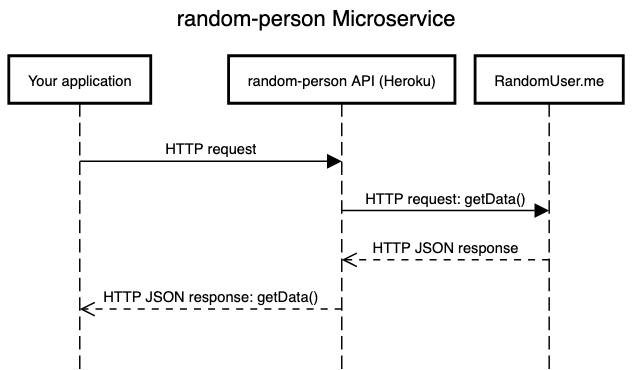

# random-person

A microservice that delivers a JSON object with the name and details of a random (fictional) person from [RandomUser.me](http://RandomUser.me) via HTTP.

## How to request data from this microservice
You can request data with JavaScript `fetch` or `XMLHttpRequest`.

HTTP Method: GET

### JavaScript fetch example, for your application on localhost


```js
let API = 'http://localhost:3000/random-person';


return fetch(API)
      .then((resp) => resp.json())
      .then((json) => {
        if (json.error) {
          console.log(json.error);
        } else if (json.results) {
          useData(json);
        }
    })
     .catch((err) => console.error(err));

```
## How to receive data from this microservice
If your HTTP request succeeds, you'll get a JSON object structured as below.

```js
{
	"results": [
		{
			"gender": ...,
			"name": {
				"title": ...,
				"first": ...,
				"last": ...
			},
			"location": {
				"street": {
					"number": ...,
					"name": ...
				},
				"city": ...,
				"state": ...,
				"country": ...,
				"postcode": ...,
				"coordinates": {
					"latitude": ...,
					"longitude": ...
				},
				"timezone": {
					"offset": ...,
					"description": ...
				}
			},
			"email": ...,
			"login": {
				"uuid": ...,
				"username": ...,
				"password": ...,
				"salt": ...,
				"md5": ...,
				"sha1": ...,
				"sha256": ...
			},
			"dob": {
				"date": ...,
				"age": ...
			},
			"registered": {
				"date": ...,
				"age": ...
			},
			"phone": ...,
			"cell": ...,
			"id": {
				"name": ...,
				"value": ...
			},
			"picture": {
				"large": ...,
				"medium": ...,
				"thumbnail": ...
			},
			"nat": ...
		}
	],
	"info": {
		"seed": ...,
		"results": 1,
		"page": 1,
		"version": "1.4"
	}
}

````
You can structure this data with JavaScript/HTML.


```js
/* Create a node and display the string that represents the person.*/

const useData = (data)=> {
  const person = data.results[0];
  const div = document.createElement("div");
  div.textContent = `${person.name.first} ${person.name.last}`;
  document.body.appendChild(div);
}

```
### The data you'll receive
At present, you'll get a single record generated by [RandomUser](https://randomuser.me/). There are currently 12 different made-up attributes you can retrieve about this fictional person, which you can examine at the RandomUser site documentation.

### How to install this application locally
```console
$  git clone https://github.com/mejarc/random-person-microservice.git
$  cd random-person-microservice
$  npm i
$  npm start
```

Note that you will have to install a [CORS](https://developer.mozilla.org/en-US/docs/Web/HTTP/CORS) workaround in your application to use a locally hosted version of this microservice.


## UML sequence diagram


### Contributors
@mejarc